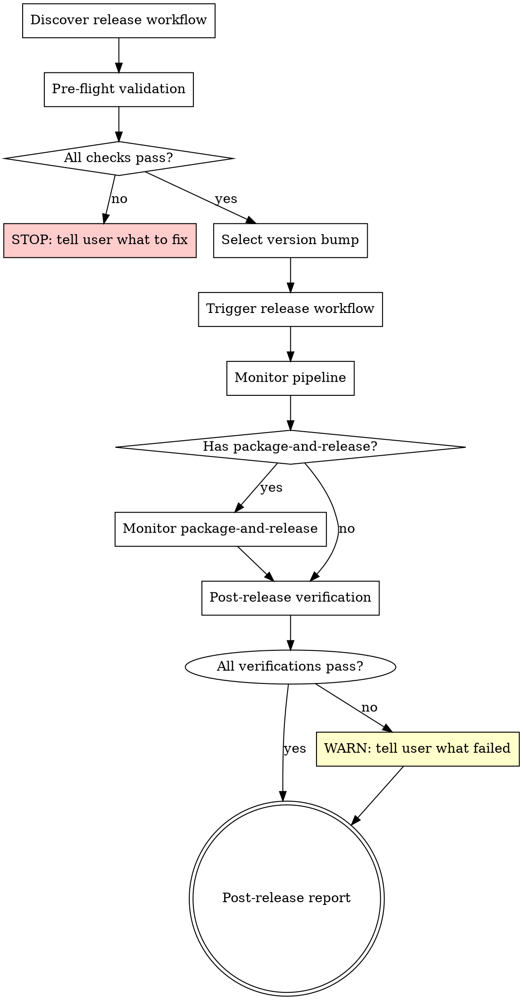

# Releasing a Python Library

## Overview

Guide the release of a Python library by discovering the repo's release workflow, validating preconditions, selecting version bump type, triggering the GitHub Actions release pipeline, and monitoring until complete.

**Core principle:** Discover the release mechanism dynamically. If the expected workflows don't exist, stop and tell the user.

## Process Flow



## Step 1: Workflow Discovery

Discover which release workflow the repo uses:

```bash
# Check for known release workflow files
ls .github/workflows/new-release.yaml .github/workflows/release.yaml 2>/dev/null
```

**Priority order:**
1. `new-release.yaml` -- modern 2-workflow pattern (bumps version, creates tag, triggers `package-and-release.yaml`)
2. `release.yaml` -- single-workflow pattern (does everything in one workflow)

If neither exists, **STOP** with error: "No release workflow found. Expected `new-release.yaml` or `release.yaml` with `workflow_dispatch` trigger in `.github/workflows/`."

Also detect whether `package-and-release.yaml` exists -- this determines whether to monitor a second workflow.

Detect the workflow's input parameter name by checking the file:
- `new-release.yaml` typically uses `version_type`
- `release.yaml` typically uses `release_type`

```bash
# Extract the input parameter name
grep -A2 'workflow_dispatch' .github/workflows/<workflow-file> | grep -oP '\w+_type'
```

## Step 2: Pre-flight Validation

Run ALL checks before triggering. Any failure = **STOP immediately**.

| Check | Command | Expected |
|-------|---------|----------|
| Python project | `test -f pyproject.toml` | File exists |
| On master branch | `git branch --show-current` | `master` |
| Clean working tree | `git status --porcelain` | Empty output |
| Up-to-date with remote | `git fetch origin master && git rev-list HEAD..origin/master --count` | `0` |

If any check fails, explain exactly what's wrong and how to fix it. Do NOT proceed.

## Step 3: Version Selection

```bash
# Get current version from latest git tag
git tag -l "[0-9]*.[0-9]*.[0-9]*" --sort=-version:refname | head -n 1
```

Calculate what each bump produces and ask the user to choose via the `question` tool. Present options like:

- **patch** (1.4.0 -> 1.4.1) -- bugfix only
- **minor** (1.4.0 -> 1.5.0) -- new feature, backward compatible
- **major** (1.4.0 -> 2.0.0) -- breaking change

## Step 4: Trigger Release

```bash
# Trigger the release workflow
gh workflow run "<workflow-file>" -f <param_name>=<patch|minor|major> --ref master

# Wait for the run to appear, then get its ID and URL
sleep 5
gh run list --workflow=<workflow-file> --limit 1 --json databaseId,status,url
```

Show the workflow run URL to the user.

## Step 5: Monitor Pipeline

```bash
# Watch the release workflow
gh run watch <RUN_ID> --exit-status
```

If `package-and-release.yaml` exists:
```bash
# Wait for the tag-triggered workflow to start
sleep 10
gh run list --workflow=package-and-release.yaml --limit 1 --json databaseId,status,url
gh run watch <RUN_ID_2> --exit-status
```

On failure, show logs:
```bash
gh run view <RUN_ID> --log-failed
```

## Step 6: Post-Release Verification

After all workflows succeed, verify the release artifacts are correct before reporting success.

### 6a. Verify pyproject.toml version was updated

The release workflow commits a version bump to `master`. Pull the latest changes and confirm the version in `pyproject.toml` matches the new release:

```bash
# Pull the version bump commit made by the release workflow
git pull origin master

# Check the version in pyproject.toml matches the new tag
grep -m1 'version' pyproject.toml
# For monorepos, also check sub-packages:
# grep 'version' packages/*/pyproject.toml
```

The version string in `pyproject.toml` must match the newly released version (e.g., `1.5.0`). If it doesn't, warn the user -- the version bump step may have failed silently.

### 6b. Verify package is installable from Nexus

Confirm the released package version is available in the package registry:

```bash
# Install the released version and verify it appears in pip list
pip install <package-name>==<NEW_VERSION> --index-url <nexus-url>/simple
pip list | grep <package-name>
```

The installed version must match the new release version. If the package is not found or the version is wrong, warn the user -- the Nexus upload step may have failed.

**Note:** If the environment doesn't have access to the Nexus registry (e.g., no VPN, no credentials), skip this check and note it in the report.

## Step 7: Post-Release Report

When all workflows succeed, report:
- New version number
- GitHub Release URL (from `gh release view <VERSION> --json url`)
- Whether packages were published to Nexus (if `package-and-release.yaml` was involved)
- Post-release verification results (pyproject.toml version, pip install check)
- Install command: read package name from `pyproject.toml`

## Troubleshooting

| Issue | Cause | Fix |
|-------|-------|-----|
| No release workflow found | Missing `new-release.yaml` or `release.yaml` | Check `.github/workflows/` directory |
| Version validation fails in CI | `pyproject.toml` version doesn't match tag | Version bump step failed; check workflow logs |
| Nexus upload fails | Bad credentials or version already exists | Verify `NEXUS_USERNAME`/`NEXUS_PASSWORD` secrets |
| Workflow not triggered | Not on master or missing workflow_dispatch | Ensure you're on `master` |
| Tag already exists | Previous release attempt left a tag | Delete: `git push origin :refs/tags/<TAG> && git tag -d <TAG>` |
| pyproject.toml version mismatch | Version bump commit failed or wasn't pushed | Check workflow logs for the "Commit version updates" step |
| Package not found in Nexus | Upload step failed or version already existed | Check `package-and-release.yaml` logs for Nexus upload errors |

## Red Flags

| Thought | Reality |
|---------|---------|
| "I'll skip pre-flight checks" | Pre-flight catches issues that waste CI time. Always run them. |
| "I'll trigger from a feature branch" | All release workflows require `master`. It will fail silently. |
| "I'll push the tag manually" | Use the workflow -- it handles pyproject.toml version bumps too. |
| "I'll just run the build locally" | The workflow handles Nexus credentials, tests, and GH Release creation. |
